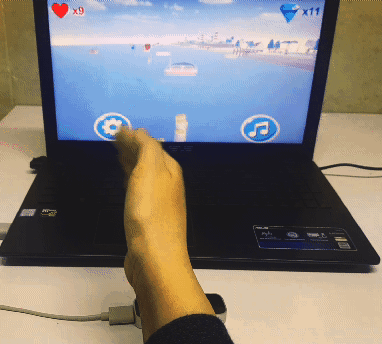
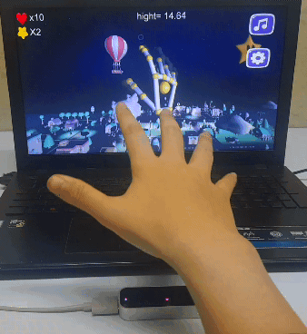
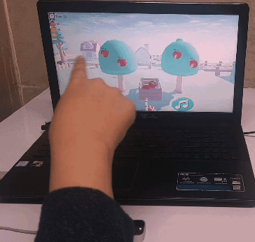

Designing four rehabilitation games utilizing a Leap motion sensor using Unity.

* **Aircraft game:** To pilot an aircraft, the player must perform supination and pronation movements.

  
* **Boating game:** The boat is controlled by wrist flexion and extension.

  
* **Balloon game:**  The participant is forced to perform opening and closing movements to advance the game and earn points.

  
* **Gardening game:** The purpose of this game is to pick fruits,  by moving the finger extension and forearm supination.

  
